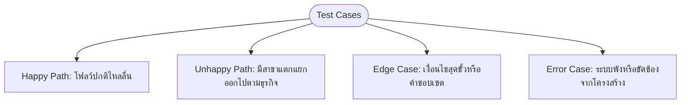
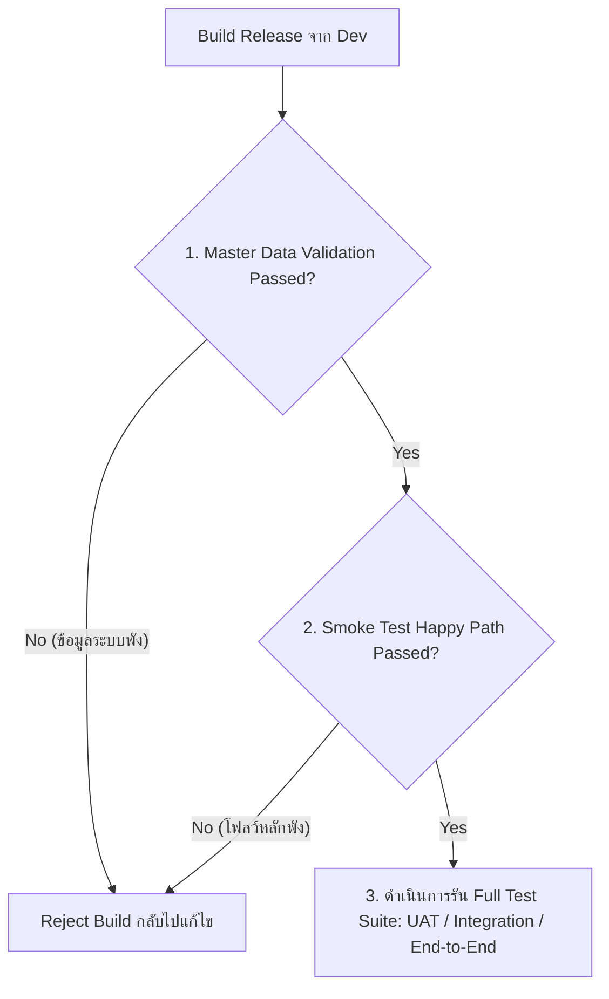

# QA Methodology & HIS Testing Strategy (Knowledge Management)

เอกสารฉบับนี้จัดทำขึ้นเป็นคลังความรู้ (KM) เพื่อทำความเข้าใจเกี่ยวกับระเบียบวิธีทดสอบตามมาตรฐานสากล (Standard QA Methodology), ความรับผิดชอบระหว่าง Dev กับ QA, ประเภทเจตนาการทดสอบ (Test Intent Classification), และกลยุทธ์การรับมือความเสี่ยงกรณีระบบยังมีบั๊กในระดับ Unit Test และ Master Data สูง

---

## 🔒 1. แผนผังความรับผิดชอบงานทดสอบ (QA Responsibility Mapping)

เพื่อให้การทดสอบระหว่างทีมผู้พัฒนา (Dev) และทีมทดสอบระบบ (QA) ทำงานสอดประสานกันและไม่ทับซ้อนกัน ได้กำหนดกรอบความรับผิดชอบแยกตามแกนหลักดังนี้:

| แกนการวิเคราะห์ | 💻 Dev | 🔍 QA |
| :--- | :--- | :--- |
| **Test Level** | Unit | Integration → System → UAT |
| **Test Type — Functional** | ✅ ระดับ unit (isolated, mocked dependencies) | ✅ ระดับ flow / journey (real dependencies, cross-module) |
| **Test Type — Non-Functional** | ❌ ไม่รับผิดชอบ | ✅ Security · Performance · Interoperability · Compliance |
| **Test Intent** | Input-level (ตรวจสอบความถูกต้องของข้อมูลเข้า-ออก) | Test Flow (Happy Path, Unhappy Path, Edge Case, Error Case) |

> **หมายเหตุ:** ทั้ง Dev และ QA ทำ Functional Testing ด้วยกัน แต่คนละ Level — Dev ทดสอบ function แยกชิ้นในสภาพแวดล้อมจำลอง (mock), QA ทดสอบว่า function เหล่านั้นทำงานร่วมกันได้ถูกต้องในบริบทจริงของโรงพยาบาล (patient journey, cross-module data integrity)

### 5 จุดแข็งที่ทีม QA ต้องมุ่งเน้นเพื่อสร้างมูลค่าเพิ่ม (QA Value-Add):
1.  **Integration / System (การเชื่อมต่อระหว่าง Module):** ในขั้นตอน Unit Test ของฝั่ง Dev จะใช้การจำลอง (Mocking) ระบบรอบข้าง ทำให้ไม่สามารถตรวจพบปัญหาการทำงานร่วมกันจริงได้ ทีม QA ต้องทดสอบการส่งข้อมูลข้ามแผนก เช่น *OPD สั่ง Lab -> ใบสั่งงานต้องไปโผล่ที่โมดูล LIS และเมื่อ LIS ส่งผลกลับมา EMR ต้องแสดงผลได้ถูกต้องโดยข้อมูลไม่เพี้ยนหรือตกหล่น*
2.  **End-to-End Flow (มุมมองผู้ใช้จริง):** Dev มักจะไม่คุ้นเคยกับเส้นทางการรักษาของผู้ป่วยจริง (Patient Journey) ทีม QA ต้องจำลองบทบาทผู้ใช้ เช่น หมอ พยาบาล เภสัชกร การเงิน เพื่อรันโปรแกรมให้ครบลูปเส้นทางเดินสะดุดในโรงพยาบาล
3.  **Non-Functional Quality (ด้านที่ Unit Test ไม่ครอบคลุม):**
    *   **Security:** ตรวจสอบสิทธิ์การเข้าถึงข้อมูลตามสิทธิ์ผู้ใช้งาน (RBAC), ตรวจความปลอดภัยข้อมูลสุขภาพผู้ป่วย (PHI Protection) และบันทึก Audit Logs
    *   **Performance:** ความเร็วในการประมวลผลช่วงเช้าที่มีผู้ป่วยหนาแน่น
    *   **Interoperability:** การเชื่อมต่อมาตรฐานสากล เช่น HL7, DICOM, สปสช. (NHSO)
    *   **Compliance:** ความถูกต้องของข้อมูลเบิกจ่ายและมาตรฐานรหัส ICD-10
4.  **Real Environment & Real Data:** การทดสอบบนสภาพแวดล้อมเสมือนจริงและข้อมูลจริงที่มีการกำหนดค่า (Configurations) หลากหลาย เช่น ค่าตามไซต์งาน (Site Config), เขตเวลา (Timezone) และข้อมูลคนไข้จริงที่มีเงื่อนไขแปลกๆ
5.  **UI/UX (สิ่งที่คนไข้และเจ้าหน้าที่สัมผัส):** ตรวจสอบตำแหน่งปุ่มกด ความลื่นไหลของหน้าจอ และความเข้าใจง่ายของข้อความแจ้งเตือนเมื่อเกิดความผิดพลาด (Error Message)

---

## 🎯 2. ประเภทเจตนาการทดสอบ (Test Intent Classification)

ในการออกแบบเทสเคสสำหรับระบบ HIS จะใช้เกณฑ์การจำแนกเจตนาในการทดสอบออกเป็น 4 รูปแบบหลัก:

1.  **Happy Path (เส้นทางทำงานปกติ):**
    *   **นิยาม:** โฟลว์ปกติที่ผู้ใช้งานส่วนใหญ่ทำเป็นประจำ ข้อมูลนำเข้าถูกต้องและสามารถไหลลื่นตามขั้นตอนการทำงานที่กำหนดไว้โดยไม่มีข้อบกพร่องใดๆ
    *   **ตัวอย่าง (HIS):** ผู้ป่วยมีใบนัดหมายล่วงหน้า -> แสกนเช็คอิน -> พยาบาลตรวจคัดกรอง -> แพทย์สั่งยากลับบ้าน -> ชำระเงินค่ารักษาพยาบาล -> ห้องยาส่งมอบยา -> คนไข้เดินทางกลับบ้านอย่างสมบูรณ์
2.  **Unhappy Path (เส้นทางที่ซับซ้อนแต่มีธุรกิจรองรับ):**
    *   **นิยาม:** โฟลว์การทำงานที่มีทางเบี่ยงหรือมีความเบี่ยงเบนจากสถานการณ์ปกติ แต่ยังคงเป็นกรณีที่เกิดขึ้นจริงในระบบงานจริงของสถานพยาบาล ซึ่งระบบต้องจัดการขั้นตอนเหล่านี้ได้อย่างถูกต้อง ไม่ใช่ระบบเกิดการ Crash หรือพังเสียหาย
    *   **ตัวอย่าง (HIS):** ผู้ป่วย Walk-in ไม่มีนัด (ต้องดำเนินการแทรกคิวระหว่างรอตรวจ), แพทย์ปฏิเสธการขอรักษาและขอยกเลิกเตียง Admit กลางคัน, ผู้ป่วยมีเงินไม่พอจึงขอชำระเงินเพียงบางส่วน (Partial Payment) และทำสัญญายอดค้างจ่ายไว้ก่อน
3.  **Edge Case (เงื่อนไขสุดขั้ว / ข้อมูลขอบเขตสุดโต่ง):**
    *   **นิยาม:** โฟลว์หรือฟังก์ชันการทำงานที่ต้องปะทะกับเงื่อนไขสุดขั้ว ข้อมูลขอบเขตสุดโต่ง หรือสถานการณ์การเปลี่ยนผ่านของตัวเลขระบบที่มักทำให้ระบบเกิดข้อผิดพลาดขึ้นมาเป็นพิเศษ
    *   **ตัวอย่าง (HIS):** การลงทะเบียนผู้ป่วยเด็กแรกเกิดอายุ 0 วัน, ยอดบิลคิดค่ารักษาออกมาเป็น 0 บาท, การทำธุรกรรมคาบเกี่ยวช่วงข้ามปีงบประมาณ, คิวบริการยาวเกินโควต้าสูงสุดของระบบ, การป้อนชื่อตัวอักษรยาวเกินขีดจำกัดช่องกรอกข้อมูล
4.  **Error Case (กรณีระบบทำงานขัดข้อง):**
    *   **นิยาม:** สถานการณ์ที่ระบบต้องเผชิญกับข้อผิดพลาดที่เกิดขึ้นจากปัจจัยโครงสร้างพื้นฐานหรือระบบเชื่อมต่อภายนอกล้มเหลว (ไม่ใช่ความผิดพลาดจากการป้อนข้อมูลของผู้ใช้) โดยที่ตัวแอปพลิเคชันต้องป้องกันข้อมูลสูญหาย ล็อกระบบให้อยู่ในสถานะปลอดภัย และสามารถทำการกู้คืนข้อมูลกลับมาได้เมื่อระบบฟื้นตัว
    *   **ตัวอย่าง (HIS):** เครือข่ายเน็ตเวิร์กหลุดขณะพยาบาลกดบันทึกประวัติการรับเข้าตึก IPD, ระบบตรวจสอบสิทธิ์ภายนอก (เช่น สปสช.) ล่มขณะส่งออกผลเคลม, ฐานข้อมูลขัดข้อง (Database Timeout) ระหว่างประมวลเงินค่ารักษา

---

## ⚠️ 3. กลยุทธ์เมื่อระบบมีบั๊กระดับ Unit & Master Data สูง (QA Mitigation Strategy)

เมื่อทีมพัฒนาพบปัญหาบั๊กระดับ Unit และการตั้งค่าข้อมูลระบบ (Master Data) บ่อยครั้ง ทำให้การทดสอบระบบของ QA ไม่ราบรื่น ทีม QA จำเป็นต้องปรับกลยุทธ์การทดสอบดังนี้เพื่อลดแรงเสียดทานและจำกัดขอบเขตความเสียหาย:

1.  **มาตรการคัดกรองความถูกต้องของข้อมูลระบบ (Master Data Validation Gate):**
    *   ก่อนจะเริ่มทำระบบทดสอบฟังก์ชันใดๆ ทีม QA ต้องมีสคริปต์หรือเช็คลิสต์ตรวจเช็คข้อมูลระบบตั้งต้น (Master Data) ก่อนเสมอ เช่น รหัสยา, ตารางเข้าเวรของแพทย์, รายชื่อคลินิกตรวจ, และรหัสวินิจฉัยโรค หากพบว่าข้อมูลพื้นฐานเหล่านี้ไม่สมบูรณ์หรือเสียหาย ให้ปัดตกการทดสอบ (Block) ทันที
2.  **กำหนดเกณฑ์การคัดค้าน Build ที่ไม่พร้อม (Smoke Test Gatekeeping Rule):**
    *   สร้างเกณฑ์ในการรับ Build (Acceptance Criteria) หากพบบั๊กพื้นฐานขั้นรุนแรง (เช่น ล็อกอินไม่ได้, ค้นหา HN แล้วระบบ Crash, บันทึกตัวตนแล้วฟีลด์สำคัญหาย) ให้ส่งกลับ Build คืนฝั่งพัฒนาโดยไม่เสียเวลารันระบบเทสอื่นๆ ต่อ
3.  **การแยกข้อมูลทดสอบให้ชัดเจน (Test Data Isolation & Synthetic Data):**
    *   แยกสิทธิ์การจัดการข้อมูลตั้งต้นสำหรับ QA สภาพแวดล้อมทดสอบออกจากระบบของ Dev เพื่อป้องกันไม่ให้ข้อมูล Master Data ที่กำลังอยู่ระหว่างการพัฒนาของ Dev เข้ามารบกวนขั้นตอนเทสของ QA 
4.  **เพิ่มการทดสอบจำลอง Endpoint (Interface Contract Verification):**
    *   ใช้วิธีทดสอบ API โดยตรงผ่านเครื่องมือเช่น Postman ก่อนส่งต่อผ่านหน้า UI เพื่อระบุได้ชัดเจนว่าเป็นบั๊กที่ฝั่งข้อมูล (API/Database) หรือบั๊กที่หน้าจอแสดงผล (Front-end UI) ซึ่งช่วยย่นเวลาการค้นหาจุดผิดพลาดให้ผู้พัฒนา
