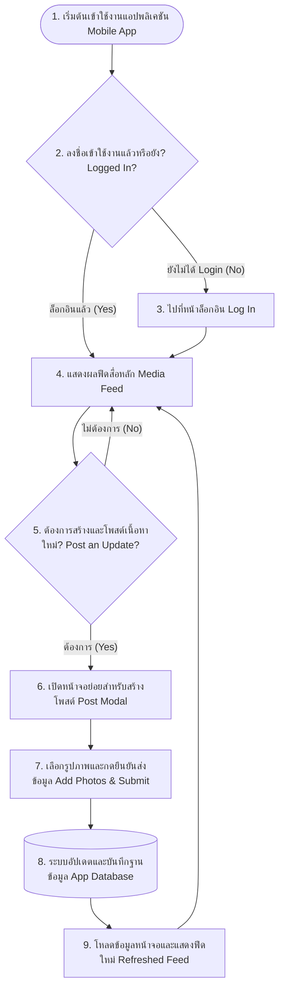

# SBH Clinical Workflows Reference Guide
## คู่มืออ้างอิงลำดับขั้นตอนการทำงานทางคลินิก (Site: SBH)

เอกสารฉบับนี้จัดทำขึ้นเพื่อรวบรวมข้อมูลขั้นตอนการทำงาน (Workflows) ทาง clinical และข้อเสนอแนะในการปรับปรุงระบบ (Improvement Suggestions) ของโรงพยาบาลไซต์ **SBH** เพื่อใช้เป็นฐานข้อมูลอ้างอิงสำหรับการวิเคราะห์และเตรียมชุดเทสเคส (Regression Test Suite) ในอนาคต

---

## 📋 สารบัญเวิร์กโฟลว์ (Workflow Directory)

1. [WF-1: ER Emergency Workflow (กระบวนการห้องฉุกเฉิน ER)](#wf-1-er-emergency-workflow-กระบวนการห้องฉุกเฉิน-er)
2. [WF-2: Improvement Suggestions for 8 Service Stations (ข้อเสนอแนะสำหรับ 8 สถานีบริการ)](#wf-2-improvement-suggestions-for-8-service-stations-ข้อเสนอแนะสำหรับ-8-สถานีบริการ)
3. [WF-3: Flowchart Template (ตัวอย่างไดอะแกรมระบบ)](#wf-3-flowchart-template-ตัวอย่างไดอะแกรมระบบ)

---

## 🏥 WF-1: ER Emergency Workflow (กระบวนการห้องฉุกเฉิน ER)

เวิร์กโฟลว์กระบวนการทำงานหลักในห้องฉุกเฉิน (Emergency Department - ER) ไหลแบบ End-to-End ตั้งแต่ผู้ป่วยเดินทางมาถึงจุดคัดกรอง การเข้าตรวจโดยแพทย์ การสั่งการรักษาตามภาวะวิกฤต การบันทึกของพยาบาล จนถึงขั้นตอนสุดท้ายในการส่งผู้ป่วยกลับบ้าน ส่งต่อ หรือรับเข้าเป็นผู้ป่วยใน (IPD Admission)

### 🔄 แผนภาพการทำงาน (Workflow Diagram)

```mermaid
flowchart TD
    %% Roles/Departments Definition
    subgraph MR [เวชระเบียน / Medical Record]
        A[1. ผู้ป่วยเดินทางมาถึงห้อง ER] --> B[2. ค้นหาประวัติ/เปิด Visit หรือลงทะเบียนผู้ป่วยใหม่]
    end

    subgraph SCR [หน้าห้อง ER - จุดคัดกรอง / Screening]
        B --> C{3. คัดกรองผู้ป่วยแยกตามประเภท}
        C -- Trauma (ผู้ป่วยอุบัติเหตุ/บาดเจ็บ) --> D1[4.1 ประเมินแผลและประเภทอุบัติเหตุ]
        C -- Non-Trauma (ผู้ป่วยทั่วไป/เจ็บป่วยเฉียบพลัน) --> D2[4.2 บันทึกสัญญาณชีพ Vital Signs & อาการสำคัญ]
    end

    subgraph DOC [ในห้อง ER - การตรวจของแพทย์ / Doctor]
        D1 --> E[5. แพทย์ประเมินและสั่งการรักษาตามแนวทาง Clinical Guideline]
        D2 --> E
        
        %% Guidelines
        E --> E1["- Stroke Fast Track (มีแบบประเมินเฉพาะ)<br>- Peritonitis (เยื่อบุช่องท้องอักเสบ)<br>- Upper GI Bleeding (เลือดออกในทางเดินอาหารส่วนบน)<br>- ACS (โรคหลอดเลือดหัวใจเฉียบพลัน)"]
        
        %% Standing Orders
        E1 --> F[6. สั่งยาและการรักษาตามแผนสั่งล่วงหน้า Standing Order เช่น Dengue]
        F --> G[7. ประเมินและสั่งการรักษาผู้ป่วยแผลไหม้ Burn Assessment]
    end

    subgraph CPOE [การสั่งการรักษา / Order entry]
        G --> H[8. เจ้าหน้าที่เวชระเบียน/ธุรการตรวจสอบข้อมูลทะเบียนผู้ป่วย]
        H --> I{9. แพทย์สั่งรักษา CPOE ตามภาวะของโรค}
        
        I -- ภาวะทางอายุรกรรม/ศัลยกรรม --> J1["- DKA & HHS (ภาวะน้ำตาลในเลือดสูง)<br>- ERCP (การส่องกล้องตรวจท่อน้ำดี)<br>- Pre-Op / Pre-OPS (เตรียมตัวผ่าตัด)<br>- Surgery (การผ่าตัดทั่วไป)<br>- Hip Fracture Fast Track (กระดูกสะโพกหัก)"]
        
        I --> K[10. ส่งตรวจวิเคราะห์ทางห้องปฏิบัติการ Lab เช่น เคมีคลินิก Chemistry]
        J1 --> K
    end

    subgraph ASS [แบบประเมินพิเศษ / Special Assessment]
        K --> L["11. บันทึกแบบประเมินพิเศษ<br>- แบบประเมิน นิติเวช/พิเศษ (Forensic/Special Assessment)<br>- แบบประเมิน Group/Folio (Group/Folio Assessment)"]
    end

    subgraph NUR [บันทึกพยาบาล / Nurse Record]
        L --> M[12. พยาบาลบันทึกการดูแลพิเศษ เช่น Ped Respiratory Failure Score]
        M --> N[13. แพทย์คีย์สรุปประวัติจำหน่ายผู้ป่วย Discharge Summary]
    end

    subgraph DIS [การส่งต่อและจำหน่ายผู้ป่วย / Discharge & Disposition]
        N --> O{14. ผลการรักษาและการส่งต่อ}
        O -- รับตัวนอนโรงพยาบาล IPD Admission --> P[15. ลงทะเบียนส่งตัวไปหอผู้ป่วยใน IPD Ward]
        O -- ส่งกลับรักษาโรงพยาบาลต้นสังกัด / สิทธิการรักษา --> Q[16. ส่งต่อผู้ป่วยกลับบ้าน/Refer Back]
        
        P --> P1[15.1 หอผู้ป่วยเด็ก PED Ward]
        P --> P2[15.2 หอผู้ป่วยผู้ใหญ่ Adult Ward]
    end
```

### 📝 อธิบายขั้นตอนการทำงาน (Step-by-Step Flow)

1.  **ลงทะเบียนเปิด Visit (ER Check-in):** เมื่อผู้ป่วยมาถึงห้องฉุกเฉิน เจ้าหน้าที่ **เวชระเบียน (Medical Record)** ดำเนินการค้นหาประวัติผู้ป่วยผ่านระบบ HIS หากไม่มีประวัติจะทำการสร้างเวชระเบียนใหม่ (Registration) และเปิด Visit การรักษาประเภทอุบัติเหตุและฉุกเฉิน (OPD-ER Visit)
2.  **การคัดกรองอาการ (Triage/Screening):** พยาบาลจุดคัดกรองประเมินระดับความฉุกเฉิน (Triage Level 1-5) และแยกผู้ป่วยออกเป็น 2 กลุ่มหลัก:
    *   **กลุ่มผู้ป่วยอุบัติเหตุ (Trauma):** ประเมินอาการบาดเจ็บของร่างกายเพื่อความรวดเร็วในการส่งเข้าห้องทำแผล/ผ่าตัดเล็ก
    *   **กลุ่มผู้ป่วยฉุกเฉินทั่วไป (Non-Trauma):** บันทึก **สัญญาณชีพ (Vital Signs)** เช่น ความดันโลหิต อัตราการเต้นของหัวใจ อุณหภูมิ และระดับออกซิเจนในเลือด พร้อมซักประวัติอาการสำคัญ
3.  **การตรวจและรักษาโดยแพทย์ (Doctor Consult & Guideline):** แพทย์เวชศาสตร์ฉุกเฉินเข้าประเมินอาการ และเลือกใช้แนวทางการรักษาเร่งด่วนตามอาการที่คัดกรองมา (Clinical Practice Guidelines) เช่น:
    *   **Stroke Fast Track:** เปิดใช้ฟอร์มประเมินและสั่งรังสีคอมพิวเตอร์ (CT Brain) และยาสลายลิ่มเลือดด่วน
    *   **Peritonitis:** การประเมินและสั่งตรวจช่องท้องด่วน
    *   **Upper GI Bleeding:** สั่งเตรียมเลือดและเตรียมส่งส่องกล้องระบบทางเดินอาหาร
    *   **ACS (Acute Coronary Syndrome):** สั่งตรวจคลื่นไฟฟ้าหัวใจ (EKG) และเจาะเลือดดูเอนไซม์หัวใจ (Troponin) ทันที
4.  **การรักษาตามคำสั่งการรักษาล่วงหน้า (Standing Order):** แพทย์หรือพยาบาลเริ่มให้การรักษาตาม Standing Order ที่กำหนดไว้ล่วงหน้าสำหรับบางโรค เช่น ไข้เลือดออก (Dengue Standing Order) เพื่อรับส่งสิ่งตรวจและให้สารน้ำทดแทนอย่างเหมาะสม
5.  **การสั่งงานรักษาเฉพาะทาง (Special CPOE Orders):** กรณีผู้ป่วยจำเป็นต้องผ่าตัดหรือทำหัตถการเฉพาะ แพทย์จะคีย์สั่งงานรักษา (CPOE) ตามชุดคำสั่งสำเร็จรูป เช่น:
    *   **DKA & HHS:** การสั่งให้ยาอินซูลินและสารน้ำควบคุมระดับน้ำตาล
    *   **Pre-Op / Pre-OPS:** สั่งตรวจเลือด เตรียมความพร้อมร่างกายเพื่อส่งเข้าห้องผ่าตัดฉุกเฉิน (Surgery)
    *   **Hip Fracture Fast Track:** ระบบสั่งจองคิวผ่าตัดและระงับปวดเร่งด่วน
6.  **การประเมินและการบันทึกพิเศษ (Special Assessment & Nurse Note):**
    *   เจ้าหน้าที่บันทึกข้อมูลทางกฎหมายหรือทางนิติเวชเพิ่มเติม หากเกี่ยวข้องกับคดีความ (แบบประเมินนิติเวช/พิเศษ)
    *   พยาบาลบันทึกการประเมินพยาบาลเฉพาะโรค เช่น **Pediatric Respiratory Failure Score** สำหรับประเมินความเสี่ยงระบบทางเดินหายใจล้มเหลวในเด็ก
7.  **การสรุปและจำหน่ายผู้ป่วย (Discharge & Disposition):** แพทย์บันทึกสรุปประวัติการรักษาส่งท้ายในโปรแกรม **Discharge Summary** จากนั้นระบบจะแยกกระบวนการจำหน่ายเป็น 3 ปลายทางหลัก:
    *   **Discharge to IPD:** ส่งตัวเข้ารักษาต่อเป็นผู้ป่วยในตามตึกผู้ป่วยเด็ก (PED Ward) หรือผู้ป่วยผู้ใหญ่ (Adult Ward)
    *   **Refer Back:** ดำเนินการส่งต่อผู้ป่วยกลับไปยังโรงพยาบาลเครือข่าย หรือกลับไปตามสิทธิการรักษากรณีส่งมาตรวจเฉพาะทาง

---

## 💡 WF-2: Improvement Suggestions for 8 Service Stations (ข้อเสนอแนะสำหรับ 8 สถานีบริการ)

ข้อเสนอแนะเพื่อปรับปรุงกระบวนการทำงานบนระบบ Cortex HIS แยกตามกลุ่มเวอร์ชันและโมดูลการทำงาน โดยมีรายละเอียดของโมดูล ER ที่ได้รับการจำแนกตามขั้นตอนการบริการของผู้ป่วย

### 📊 ตารางสรุป 8 โมดูลบริการคู่ขนาน (Parallel Service Modules)

| กลุ่มเวอร์ชันการปรับปรุง (Version Group) | รายชื่อโมดูล (Service Station) | ขอบเขตการทำงานหลัก (Scope Focus) |
| :--- | :--- | :--- |
| **Jun 24 Version** | 1. ห้องฉุกเฉิน (ER) 2. นัดหมาย (Appointment) 3. จัดเวชระเบียน / ห้องยา (Pharmacy) 4. จักษุ (Ophthalmology/Eye) 5. การแพทย์แผนไทย (Applied Thai Traditional Medicine) | การปรับปรุงส่วนติดต่อผู้ใช้งาน (UI) และลำดับขั้นการบริการคลินิกเพื่อลดระยะเวลารอคอยของผู้ป่วย |
| **Apr 29 Version** | 6. การเงิน (Cashier) 7. เบิกเคลมสิทธิ (Claim) 8. คลังเวชภัณฑ์ (Inventory) | การเชื่อมโยงข้อมูลหลังบ้าน (Back-end) และความถูกต้องของรหัสการเงินสิทธิการรักษา |

---

### 🏥 รายละเอียดของโมดูลห้องฉุกเฉิน (ER Module - Improvement Details)

การปรับปรุงแบ่งออกตาม 4 ช่วงการเดินทางของผู้ป่วย (Patient Journey) ในห้องฉุกเฉินดังนี้:

#### 1. ก่อนเข้า ER (Pre-Admission Phase)

| วัตถุประสงค์ (Objective) | คำอธิบายปัญหา / ความต้องการ (Description) | ลำดับความสำคัญ (Priority) |
| :--- | :--- | :--- |
| **การคัดกรองผู้ป่วย (Screening)** | ปัจจุบันกระบวนการบันทึกคัดกรอง ER ทั้งหมดยังทำบนกระดาษ (Paper) ต้องการหน้าจอคัดกรองฉุกเฉินในระบบ | Nice to Have |
| **คิวตรวจแพทย์ (Exam Queue)** | การจัดลำดับคิวตรวจใน ER ควรไหลอัตโนมัติอ้างอิงตามระดับความฉุกเฉิน (Triage Level 1–5) | Nice to Have |
| **การส่งตัวเข้า (Refer-In)** | ควรเชื่อมต่อข้อมูลคนไข้ที่ส่งตัวมาจากโรงพยาบาลอื่นจากระบบงาน Refer มาแสดงที่หน้าจอ ER เพื่อเตรียมความพร้อม | Nice to Have |
| **ส่งจากแผนกอื่น (Send from OPD)** | ต้องมีปุ่มและฟังก์ชันดึงเคสส่งต่อระหว่างแผนกผู้ป่วยนอก (OPD) มาที่ ER ได้อย่างสมบูรณ์ | **Must Have** |
| **สายรัดข้อมือระบุตัวตน (Wristband)** | รองรับการพิมพ์และแสกนบาร์โค้ดสายรัดข้อมือผู้ป่วยฉุกเฉิน ณ จุดแรกรับ | Nice to Have |

#### 2. หลังเข้า ER (Active Treatment Phase)

| วัตถุประสงค์ (Objective) | คำอธิบายปัญหา / ความต้องการ (Description) | ลำดับความสำคัญ (Priority) |
| :--- | :--- | :--- |
| **เปลี่ยนระดับคัดกรอง (Change Triage in OPD)** | แพทย์หรือพยาบาลสามารถปรับเปลี่ยนระดับ Triage Level ของผู้ป่วยในหน้าจอ OPD-ER ระหว่างรักษาตัวได้ | **Must Have** |
| **ซ่อนเมนูคำสั่งเดิม (Hide Continue Order Menu)** | เนื่องจากผู้ป่วยนอก ER ไม่มีกระบวนการรักษาระยะยาว จึงต้องปิดการแสดงผลเมนู Continue Order เพื่อป้องกันแพทย์กดซ้ำซ้อน | **Must Have** |
| **หน้าจอกระดานสถานะ (White Board)** | มีหน้าจอแสดงผลสถานะรวม (Dashboard/White Board) เพื่อบอกโซนเตียง สถานะการสั่งงาน และผู้รับผิดชอบใน ER | Nice to Have |
| **สัญญาณชีพส่วนกลาง (Central Vital Sign)** | สามารถแสดงผลและบันทึกค่าสัญญาณชีพจากเครื่องตรวจจับสัญญาณชีพส่วนกลาง (Central Monitor) เข้าหน้า EMR โดยตรง | **Must Have** |
| **รายการสั่งตรวจด่วน (Order Lab Checklist)** | จัดทำเมนูรายการสั่งตรวจแล็บด่วนตามมาตรฐาน ER (Lab Checklist) เพื่อให้แพทย์คลิกสั่งตรวจได้ทันทีโดยไม่ต้องค้นหารายตัว | Nice to Have |
| **ตัวกรองประวัติ (Filter Activity List)** | มีตัวกรองเพื่อเลือกดูรายการกิจกรรมและการรักษาทางการพยาบาลใน EMR ให้สแกนดูข้อมูลง่ายขึ้น | Nice to Have |

#### 3. เตรียมจำหน่ายจาก ER ไปจุดต่าง ๆ (Discharge & Disposition Phase)

| วัตถุประสงค์ (Objective) | คำอธิบายปัญหา / ความต้องการ (Description) | ลำดับความสำคัญ (Priority) |
| :--- | :--- | :--- |
| **สั่งรับตัวเป็นผู้ป่วยใน (Order Admit Request)** | ฟังก์ชันการสั่งรับตัวผู้ป่วยในมีในส่วน OPD ทั่วไปแล้ว แต่ต้องปรับใช้ในหน้ารักษา ER | **Must Have** |
| **ขั้นตอนสั่งฟอร์มใบตอบรับ (Admit IPD Form)** | ปัจจุบันระบบยังขาดออเดอร์สำหรับกรอกและส่งใบตอบรับ IPD ไปยังตึกผู้ป่วยโดยตรง | **Must Have** |
| **ตรวจสอบเตียงว่าง (Bed Block List)** | มีหน้าจอสำหรับกดดูและจองเตียงว่าง (Bed Block List Page) จากทางตึกผู้ป่วยในได้โดยตรง | **Must Have** |
| **การโอนย้ายรายการยา (Transfer IPD Order Items)** | รองรับการโอนรายการยาหรือเวชภัณฑ์ที่แพทย์สั่งตรวจล่วงหน้าไปใช้ต่อเมื่อผู้ป่วยย้ายไปนอนตึกผู้ป่วยใน | **Must Have** |
| **แจ้งเตือนประวัติเก่า (ER Visit History Alert)** | ระบบแจ้งเตือนที่แถบ Patient Profile หรือ White Board หากผู้ป่วยรายนี้เคยเข้ารักษาตัวที่ ER ภายใน 24–48 ชม. ก่อนหน้า | Nice to Have |

#### 4. ห้องสังเกตอาการ (Observe Room / Short Stay Phase)

| วัตถุประสงค์ (Objective) | คำอธิบายปัญหา / ความต้องการ (Description) | ลำดับความสำคัญ (Priority) |
| :--- | :--- | :--- |
| **บันทึกรหัสค่าใช้จ่าย (Billing Code Logic)** | ผู้ป่วยที่นอนสังเกตอาการระยะสั้น (Short Stay) ให้ใช้ Code ร่วมกับ IPD ส่วนผู้ป่วยสังเกตอาการ OPD ทั่วไปให้ใช้ Code แยกต่างหาก | |
| **การสั่งอาหาร (Dietary Order)** | ระบบรองรับการสั่งอาหารให้ผู้ป่วยนอนสังเกตอาการเตียง Observe Room ได้ แต่ปัจจุบันยังขาดระบบสั่งเตียงเฉพาะ | |
| **สั่งยาตึกสังเกตอาการ (Observe Medication)** | การสั่งยาผู้ป่วย Observe Room ต้องมีขั้นตอน: สั่งจาก OPD / เปิดหมายเลขผู้ป่วยในสำรอง (AN) / จองเตียง (Bed Block) | **Must Have** |

---

## 📊 WF-3: Flowchart Template (ตัวอย่างไดอะแกรมระบบ)

ไดอะแกรมตัวอย่างการทำงานของระบบแอปพลิเคชันมือถือ (Mobile Application Flow Template) เพื่อแสดงทิศทางการตัดสินใจและการบันทึกข้อมูลของแอปพลิเคชัน

### 🔄 แผนภาพตัวอย่าง (Template Diagram)

