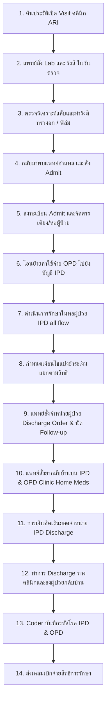
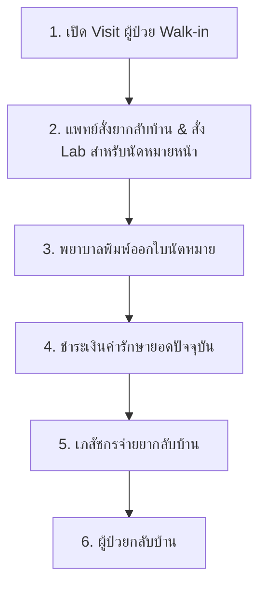
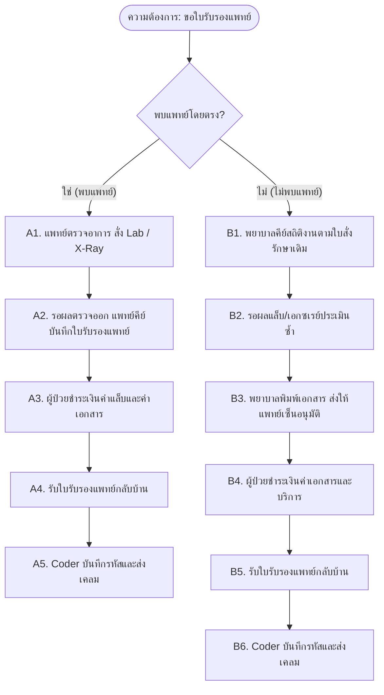
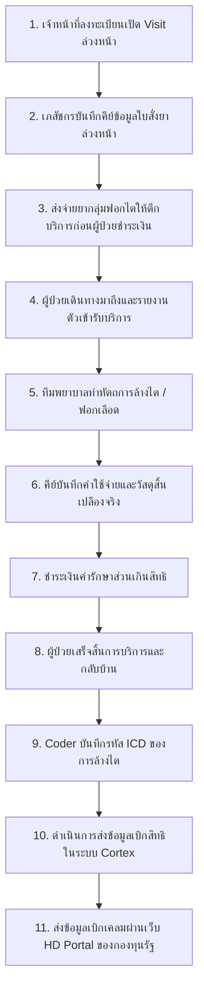
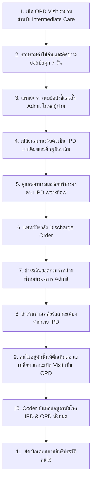
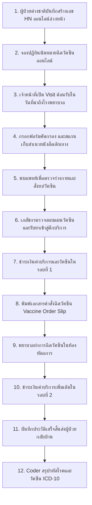

# TMH Clinical Workflows Reference Guide
## คู่มืออ้างอิงลำดับขั้นตอนการทำงานทางคลินิก (Site: TMH)

เอกสารฉบับนี้จัดทำขึ้นเพื่อรวบรวมข้อมูลขั้นตอนการทำงาน (Workflows) ทางคลินิกของโรงพยาบาลไซต์ **TMH** เพื่อใช้เป็นข้อมูลอ้างอิง (Knowledge Base) ในการวิเคราะห์ ออกแบบ และเขียนเทสเคส (Test Cases/Test Scenarios) ในอนาคต

---

## 📋 สารบัญเวิร์กโฟลว์ (Workflow Directory)

1. [WF-1: Fever Clinic - New Patient (ผู้ป่วยใหม่มาคลินิกไข้)](#wf-1-fever-clinic---new-patient-ผู้ป่วยใหม่มาคลินิกไข้)
2. [WF-2: ARI Clinic - Existing Patient to IPD Admission (ผู้ป่วยเก่ามาคลินิก ARI -> Admit)](#wf-2-ari-clinic---existing-patient-to-ipd-admission-ผู้ป่วยเก่ามาคลินิก-ari---admit)
3. [WF-3: Walk-in Patient (ผู้ป่วย walk-in)](#wf-3-walk-in-patient-ผู้ป่วย-walk-in)
4. [WF-4: Medical Certificate Request (ผู้ป่วยขอใบรับรองแพทย์)](#wf-4-medical-certificate-request-ผู้ป่วยขอใบรับรองแพทย์)
5. [WF-5: Dialysis Patient Workflow (ผู้ป่วยล้างไต)](#wf-5-dialysis-patient-workflow-ผู้ป่วยล้างไต)
6. [WF-6: New Patient to PT Consult (ผู้ป่วยใหม่ -> consult PT)](#wf-6-new-patient-to-pt-consult-ผู้ป่วยใหม่---consult-pt)
7. [WF-7: Intermediate Care Workflow (Intermediate care)](#wf-7-intermediate-care-workflow-intermediate-care)
8. [WF-8: Travel & International Patient (Travel -> ผู้ป่วยต่างชาติ)](#wf-8-travel--international-patient-travel---ผู้ป่วยต่างชาติ)

---

## 🏥 รายละเอียดขั้นตอนการทำงาน (Detailed Clinical Workflows)

### WF-1: Fever Clinic - New Patient (ผู้ป่วยใหม่มาคลินิกไข้)

ลำดับขั้นตอนการรักษาของผู้ป่วยใหม่ที่เข้ารับการรักษาที่คลินิกไข้ โดยมีการสั่งยากลับบ้าน สั่งตรวจ Lab ล่วงหน้าสำหรับการนัดหมายครั้งต่อไป และกระบวนการตรวจรักษาในวันนัด

#### 🔄 แผนภาพการทำงาน (Workflow Diagram)
```mermaid
flowchart TD
    %% Day 1
    subgraph Day 1: ครั้งแรกที่มาโรงพยาบาล
        D1_1[1. ลงทะเบียนผู้ป่วยใหม่ / สร้าง HN] --> D1_2[2. คัดกรองอาการคลินิกไข้ + บันทึก V/S]
        D1_2 --> D1_3[3. พบแพทย์: สั่งยากลับบ้าน & สั่ง Lab สำหรับครั้งหน้า]
        D1_3 --> D1_4[4. ออกใบนัดหมาย]
        D1_4 --> D1_5[5. ชำระเงินค่ารักษาและค่ายา]
        D1_5 --> D1_6[6. เภสัชกรจ่ายยากลับบ้าน]
        D1_6 --> D1_7[7. ผู้ป่วยกลับบ้าน]
    end

    %% Day 2
    subgraph Day 2: วันนัดหมายครั้งถัดไป
        D2_1[8. เปิด Visit จากใบนัดเดิม] --> D2_2[9. เจาะเลือดส่งตรวจ Lab]
        D2_2 --> D2_3[10. พบแพทย์ / อ่านผลตรวจวิเคราะห์]
        D2_3 --> D2_4[11. แพทย์สั่งยาการรักษา]
        D2_4 --> D2_5[12. ชำระเงินค่ารักษาและค่ายา]
        D2_5 --> D2_6[13. เภสัชกรจ่ายยา]
        D2_6 --> D2_7[14. ผู้ป่วยกลับบ้าน]
    end

    %% Post Visit
    subgraph Post-Visit
        D2_7 --> PV_1[15. Coder บันทึกรหัสโรค ICD]
        PV_1 --> PV_2[16. ส่งข้อมูลเบิกเคลมตามสิทธิผู้ป่วย]
    end
```

#### 📝 อธิบายขั้นตอนการทำงาน (Step-by-Step Flow)

*   **ครั้งแรกที่มาโรงพยาบาล (Day 1):**
    1.  **ลงทะเบียน (Registration):** ผู้ป่วยใหม่ลงทะเบียนประวัติส่วนตัวในระบบเพื่อสร้างเลขประจำตัวผู้ป่วย (HN)
    2.  **คัดกรอง (Screening):** พยาบาลคลินิกไข้ซักประวัติ กรอกฟอร์มคัดกรองเฉพาะโรค และบันทึกสัญญาณชีพ (Vital Signs: BP, Pulse, Temp, RR)
    3.  **พบแพทย์ (Doctor Consult):** แพทย์ตรวจรักษา บันทึก EMR สั่งยากลับบ้าน และสั่งตรวจวิเคราะห์ทางห้องปฏิบัติการ (Lab) ล่วงหน้าสำหรับการนัดครั้งต่อไป
    4.  **ออกใบนัด (Appointment):** พยาบาลหรือเจ้าหน้าที่ประสานงานพิมพ์ใบนัดหมายวัน-เวลา และคำแนะนำการเตรียมตัวก่อนตรวจ Lab
    5.  **จ่ายเงิน (Billing/Payment):** ผู้ป่วยชำระเงินค่าตรวจวิเคราะห์ สัญญาณชีพ และค่ายาของวันแรกที่เคาน์เตอร์การเงิน
    6.  **รับยา (Dispensing):** เภสัชกรตรวจสอบความถูกต้องของใบสั่งยา จัดเตรียม และอธิบายการใช้ยาก่อนส่งมอบให้ผู้ป่วย
    7.  **กลับบ้าน (Depart):** ผู้ป่วยเสร็จสิ้นขั้นตอนในวันแรก
*   **วันนัดหมายครั้งถัดไป (Day 2):**
    8.  **เปิด Visit (Check-in):** เจ้าหน้าที่จุดลงทะเบียนตรวจสอบใบนัดและเปิด Visit การรักษารวมถึงสิทธิการรักษาของวันนั้น
    9.  **เจาะเลือด (Blood Draw):** เจ้าหน้าที่ห้องแล็บตรวจสิทธิ์ใบสั่งแล็บล่วงหน้า ทำการเจาะเลือดและรับสิ่งส่งตรวจเข้าวิเคราะห์ในระบบ LIS
    10. **พบแพทย์ (Doctor Consult):** เมื่อผลตรวจแล็บออก แพทย์เรียกผู้ป่วยเข้าพบเพื่ออธิบายผลตรวจวิเคราะห์อาการ
    11. **สั่งยา (Prescribe):** แพทย์พิจารณาความต่อเนื่องของการรักษาและสั่งยา
    12. **จ่ายเงิน (Billing):** ผู้ป่วยชำระเงินค่าตรวจแพทย์ ค่าบริการพยาบาล และค่ายาที่เกิดขึ้นใน Visit วันนี้
    13. **รับยา (Dispensing):** ห้องยาจ่ายยาพร้อมคำแนะนำการใช้ยา
    14. **กลับบ้าน (Depart):** ผู้ป่วยเสร็จสิ้นขั้นตอนในวันนัดหมาย
*   **หลังสิ้นสุดการรักษา (Post-Visit Billing):**
    15. **Coder:** เจ้าหน้าที่เวชระเบียนตรวจสอบประวัติการรักษาทั้งหมดใน EMR และบันทึกรหัสวินิจฉัยโรค (ICD-10) และรหัสหัตถการ (ICD-9-CM)
    16. **ส่งเบิก (Claim):** เจ้าหน้าที่ส่งเบิกทำการตรวจสอบความสมบูรณ์ของแฟ้มประวัติ ดึงรหัสโรค และส่งข้อมูลเบิกไปยังหน่วยงานประกันหรือกองทุนสุขภาพตามสิทธิของผู้ป่วย

---

### WF-2: ARI Clinic - Existing Patient to IPD Admission (ผู้ป่วยเก่ามาคลินิก ARI -> Admit)

เวิร์กโฟลว์ของผู้ป่วยเก่าที่มีประวัติในโรงพยาบาลแล้ว เดินทางมาตรวจที่คลินิก ARI มีการส่งแล็บและรังสีเร่งด่วนในวัน แพทย์ตัดสินใจให้นอนโรงพยาบาล (Admit) และมีการโอนย้ายค่าใช้จ่ายจากผู้ป่วยนอกไปยังบัญชีผู้ป่วยใน

#### 🔄 แผนภาพการทำงาน (Workflow Diagram)


#### 📝 อธิบายขั้นตอนการทำงาน (Step-by-Step Flow)

1.  **คัดกรองเปิด visit (OPD Check-in):** ค้นหาประวัติผู้ป่วยเก่าในระบบดึงสิทธิหลัก และเปิด Visit สำหรับคลินิกตรวจโรคติดเชื้อทางเดินหายใจเฉียบพลัน (ARI Clinic)
2.  **สั่งแล็บ/รังสี (CPOE):** แพทย์ตรวจอาการเบื้องต้นและบันทึกสั่งตรวจแล็บด่วน (เช่น Swab Test) และตรวจทางรังสี (เช่น Chest X-Ray) ที่จุดตรวจ
3.  **ทำ Lab & X-Ray (Diagnostics):** ผู้ป่วยทำตามรายการตรวจวิเคราะห์แล็บและรังสี เจ้าหน้าที่บันทึกรายงานและฟิล์มเข้าระบบ LIS / PACS / RIS
4.  **สั่ง Admit (Admission Order):** แพทย์อ่านผลแล็บและฟิล์มเอกซเรย์ พบข้อบ่งชี้ที่ต้องรับการรักษาตัวในโรงพยาบาล จึงกรอกฟอร์ม Admission Order ในระบบ EMR
5.  **จองเตียง (Bed Management):** เจ้าหน้าที่งาน Admit ตรวจสอบเอกสารรับตัว ดำเนินการลงทะเบียน IPD และระบุหอผู้ป่วย (Ward) และเตียงนอน
6.  **โอนย้ายค่าใช้จ่าย (Transfer Charges):** เจ้าหน้าที่ตรวจสอบค่าใช้จ่ายส่วนของ OPD ที่เกิดขึ้นในวันนี้ และกดโอนรายการทั้งหมดเข้าบัญชีผู้ป่วยใน (IPD Account) เพื่อให้เบิกจ่ายรวมเป็นก้อนเดียวกันตามสิทธิ
7.  **ขั้นตอนการดูแลผู้ป่วยใน (IPD Care):** พยาบาลตึกรับตัว ทำการบันทึก V/S รายชั่วโมง บริหารยาตามคำสั่งการรักษาใน MAR (Medication Administration Record) บันทึก Nurse Note และให้การรักษาต่อเนื่อง
8.  **แบ่งชำระเงิน (Split Billing Setup):** การเงินตรวจสอบสิทธิร่วมของผู้ป่วย (เช่น ประกันสังคมร่วมกับประกันสุขภาพเอกชน) และทำการแบ่งสิทธิชำระเงิน (Co-Payment/Split Invoice) ในระบบการเงิน
9.  **สั่ง Discharge & นัดหมาย (Discharge & Appt):** เมื่ออาการดีขึ้น แพทย์สั่ง Discharge Order ระบุประเภทการจำหน่าย และบันทึกใบนัดหมายติดตามอาการแบบผู้ป่วยนอก (OPD Follow-up)
10. **สั่งยากลับบ้าน (Home Meds):** แพทย์สั่งยาสำหรับกลับไปทานที่บ้านผ่านระบบย่อย IPD Home Medication และเชื่อมโยงไปที่ OPD Clinic (Home Meds) โดยจัดกลุ่มเป็น ยาโรคเฉียบพลัน (Acute Medication) และยาโรคเรื้อรัง (NCD Medication)
11. **ชำระเงินจำหน่าย (Financial Discharge):** ผู้ป่วยหรือญาติมาชำระค่าใช้จ่ายและส่วนต่างที่เคาน์เตอร์การเงินผู้ป่วยใน
12. **ส่งผู้ป่วยกลับบ้าน (Physical Discharge):** พยาบาลตรวจสอบสถานะชำระเงิน คืนทรัพย์สินส่วนตัว ส่งมอบยากลับบ้านที่จัดโดยห้องยา และทำกระบวนการปล่อยตัวผู้ป่วยออกจากระบบเตียง
13. **Coder (Coding):** เจ้าหน้าที่งาน Coding ตรวจสอบประวัติการรักษาทั้งหมดเพื่อสรุป ICD-10 ของโรคหลัก โรคร่วม และรหัสหัตถการผ่าตัด (ICD-9-CM) พร้อมคำนวณค่าน้ำหนักสัมพัทธ์ (DRG) สำหรับสิทธิบัตรทอง/ประกันสังคม
14. **ส่งเคลม (Claim Submission):** ส่งข้อมูลผลลัพธ์การเข้ารหัสเข้าสู่แฟ้มส่งเบิกเคลมระบบหลักของโรงพยาบาล

---

### WF-3: Walk-in Patient (ผู้ป่วย walk-in)

กระบวนการสำหรับผู้ป่วยที่ไม่ได้นัดหมายล่วงหน้า (Walk-in) เข้ามารับการตรวจรักษาทั่วไป รับยา และสั่งแล็บหรือยาสำหรับตรวจในรอบถัดไป

#### 🔄 แผนภาพการทำงาน (Workflow Diagram)


#### 📝 อธิบายขั้นตอนการทำงาน (Step-by-Step Flow)

1.  **เปิด Visit (Registration):** ผู้ป่วยแจ้งอาการที่จุดประชาสัมพันธ์ เจ้าหน้าที่ทำการค้นประวัติ (หรือลงทะเบียนใหม่หากไม่มีประวัติ) และเปิด Visit การตรวจแบบทั่วไป
2.  **ตรวจรักษาและสั่งงานรักษา (CPOE):** แพทย์ตรวจรักษาเสร็จสิ้นทำการสั่งยากลับบ้านสำหรับอาการในวันนี้ และคีย์บันทึกสั่งตรวจแล็บเตรียมไว้สำหรับนัดหมายติดตามอาการในอนาคต
3.  **ออกใบนัด (Appointment Card):** ระบบสร้างตารางนัดหมายตามคำสั่งแพทย์ พยาบาลตรวจสอบความถูกต้องและพิมพ์ใบนัดมอบให้ผู้ป่วย
4.  **จ่ายเงิน (Billing):** ผู้ป่วยนำใบแจ้งค่ารักษาและค่ายาวันนี้มาชำระเงินที่ห้องการเงิน
5.  **รับยา (Dispensing):** เภสัชกรอธิบายวิธีการใช้ยากลับบ้านและส่งมอบยาให้ผู้ป่วย
6.  **กลับบ้าน (Depart):** ระบบเปลี่ยนสถานะการเข้ารับบริการของ Visit นี้เป็นเสร็จสมบูรณ์

---

### WF-4: Medical Certificate Request (ผู้ป่วยขอใบรับรองแพทย์)

เวิร์กโฟลว์การขอเอกสารใบรับรองแพทย์ แบ่งออกเป็น 2 กรณีหลัก คือ แบบที่ผู้ป่วยต้องเข้าตรวจพบแพทย์โดยตรง และแบบที่ไม่ต้องพบแพทย์ (พยาบาลคีย์ตามคำสั่งรักษารูปแบบเดิม)

#### 🔄 แผนภาพการทำงาน (Workflow Diagram)


#### 📝 อธิบายขั้นตอนการทำงาน (Step-by-Step Flow)

*   **กรณีที่ 1: ตรวจพบแพทย์โดยตรง (With Doctor Consult)**
    *   **A1. สั่งตรวจวินิจฉัย (CPOE):** แพทย์ตรวจประเมินร่างกาย สั่งแล็บหรือตรวจรังสีเพื่อนำข้อมูลมาประกอบการรับรองความแข็งแรงหรือการเจ็บป่วย
    *   **A2. ออกใบรับรองแพทย์ (Document Generation):** เมื่อผลตรวจแล็บ/รังสีออกเรียบร้อย แพทย์กรอกข้อมูลความเห็นทางการแพทย์ในโปรแกรมพิมพ์ใบรับรองแพทย์ของระบบ EMR
    *   **A3. ชำระเงิน (Billing):** ผู้ป่วยจ่ายเงินค่าหัตถการแล็บ ค่าบริการทางการแพทย์ และค่าธรรมเนียมเอกสารใบรับรองแพทย์
    *   **A4. รับเอกสารกลับบ้าน (Depart):** รับเอกสารที่พิมพ์และลงนามโดยแพทย์ผู้รักษา
    *   **A5. ส่งเบิกเคลม (Coding & Claims):** เจ้าหน้าที่เวชระเบียนคีย์รหัสวินิจฉัยโรคตามใบรับรองแพทย์และส่งเคลมตามสิทธิเบิกจ่าย
*   **กรณีที่ 2: ไม่พบแพทย์โดยตรง (Without Doctor Consult)**
    *   **B1. คีย์ออเดอร์ (Nurse CPOE Entry):** พยาบาลประจำจุดเป็นผู้กรอกข้อมูลการสั่งตรวจห้องปฏิบัติการ/รังสีในระบบโดยอ้างอิงจากใบสั่งสั่งงานรักษา (Paper Order Sheet / แบบฟอร์มขององค์กร) 
    *   **B2. รอผลตรวจ (Diagnostics):** ผู้ป่วยทำกระบวนการตรวจวิเคราะห์ และเจ้าหน้าที่ฝ่ายเทคนิคอัปโหลดผลการตรวจเข้าสู่โปรแกรม EMR
    *   **B3. ทำเอกสารใบรับรองและเซ็นชื่อ (Nurse Draft & Doc Signature):** พยาบาลประจำคลินิกตรวจสอบผลแล็บ ดึงข้อมูลส่วนตัวมาพิมพ์ร่างใบรับรองแพทย์ในระบบ จากนั้นส่งแฟ้มเสนอแพทย์เพื่อให้แพทย์อ่านประเมินผลตรวจและลงนามจริงกำกับในใบรับรองแพทย์
    *   **B4. ชำระเงิน (Billing):** ชำระค่าธรรมเนียมและแล็บ
    *   **B5. รับเอกสารกลับบ้าน (Depart):** รับใบรับรองแพทย์ที่เซ็นชื่อสมบูรณ์เรียบร้อย
    *   **B6. Coding & Claim:** บันทึกรหัสและส่งข้อมูลเคลมตามขั้นตอนปกติ

---

### WF-5: Dialysis Patient Workflow (ผู้ป่วยล้างไต)

เวิร์กโฟลว์เฉพาะสำหรับผู้ป่วยโรคไตเรื้อรังที่มารับการบริการล้างไต/ฟอกเลือด มีจุดเด่นคือการเตรียมยาและสั่งยาล่วงหน้าก่อนจ่ายยาให้กับตึกผู้ป่วย โดยระบบอนุญาตให้คนไข้ล้างไตรับยาไปใช้ก่อนชำระเงิน

#### 🔄 แผนภาพการทำงาน (Workflow Diagram)


#### 📝 อธิบายขั้นตอนการทำงาน (Step-by-Step Flow)

1.  **เปิด Visit ล่วงหน้า (Pre-Registration):** เจ้าหน้าที่จุดบริการทำการเปิด Visit และสิทธิการรักษารอไว้ในระบบตามตารางฟอกไตล่วงหน้า
2.  **เภสัชคีย์ยา (Pre-key Pharmacy):** ห้องยาตรวจสอบแผนยาประจำเป็นกลุ่มฟอกไต และบันทึกคำสั่งจัดยาเข้าระบบรอไว้ล่วงหน้า
3.  **จ่ายยาฟอกไตก่อนจ่ายเงิน (Dispense Before Pay):** เป็นกรณีอนุโลมพิเศษ ระบบห้องยาอนุญาตให้จัดและส่งมอบยาล้างไตไปเก็บรักษาที่ตึกไตเทียมเพื่อเตรียมความพร้อม โดยสถานะบิลยังเป็นยอดค้างชำระ (Pending Payment)
4.  **ผู้ป่วยเช็คอิน (Check-in):** เมื่อผู้ป่วยเดินทางมาถึงตึก พยาบาลแสกนบัตรประชาชนเพื่อทำการยืนยันการรับบริการ (Verify) และส่งตัวเข้าตึกฟอกไต
5.  **ทำหัตถการ (Dialysis Treatment):** ทีมพยาบาลทำการต่อสายฟอกเลือด บันทึกพารามิเตอร์ของเครื่องไตเทียม สัญญาณชีพ และการให้ยาระหว่างฟอกเลือดในหน้าบันทึก Dialysis Sheet
6.  **คีย์ค่าใช้จ่าย (Charge Capture):** พยาบาลคีย์บริการเพิ่มเติมและรายการเวชภัณฑ์สิ้นเปลือง เช่น เข็ม ตัวกรอง น้ำยาล้างไต และค่าน้ำยาเคมีต่างๆ ที่ใช้ใน Visit นั้น
7.  **จ่ายเงินส่วนต่าง (Billing):** ผู้ป่วยติดต่อการเงิน ชำระเงินค่ารักษาส่วนต่างที่เบิกไม่ได้ หรือค่าธรรมเนียมโรงพยาบาล (Co-pay)
8.  **กลับบ้าน (Depart):** บันทึกปล่อยตัวผู้ป่วยและปิดวิสิทการรักษารายวัน
9.  **Coder:** ลงรหัสหัตถการฟอกไตทางช่องท้องหรือการฟอกเลือดด้วยเครื่องไตเทียม (เช่น ICD-9-CM code 39.95)
10. **เบิกใน Cortex:** นำวิสิทส่งตรวจบันทึกส่งเบิกจ่ายตรง (e-Claim) ของสิทธิข้าราชการ/บัตรทองผ่านโมดูลเคลมในระบบ Cortex
11. **เบิกใน HD Portal:** นำเอกสารการใช้สิทธิ์ฟอกเลือดเข้าระบบ HD Portal ภายนอกเพื่อขออนุมัติค่าบริการล้างไตตามกองทุนพิเศษสำหรับโรคไตเสื่อมเรื้อรัง

---

### WF-6: New Patient to PT Consult (ผู้ป่วยใหม่ -> consult PT)

เวิร์กโฟลว์ผู้ป่วยใหม่ที่เข้ามาตรวจรักษาทั่วไป แล้วได้รับคำสั่งส่งปรึกษา (Consult) แผนกกายภาพบำบัด มีจุดสำคัญคือกายภาพบำบัดจะมีการนัดหมายรักษาระยะยาว และการเปิดวิสิทรักษาแต่ละรอบจะลิงก์เชื่อมโยงมาจากใบนัดหมายเดิม

#### 🔄 แผนภาพการทำงาน (Workflow Diagram)
```mermaid
flowchart TD
    %% Visit 1: Initial Consult & Plan
    subgraph Visit 1: ตรวจประเมินครั้งแรก
        V1_1[1. ลงทะเบียนคนไข้ใหม่สร้าง HN] --> V1_2[2. พบแพทย์เพื่อวินิจฉัยเบื้องต้น]
        V1_2 --> V1_3[3. แพทย์สั่ง Consult แผนกกายภาพบำบัด PT]
        V1_3 --> V1_4[4. นักกายภาพทำการตรวจประเมิน PT Assessment]
        V1_4 --> V1_5[5. ทำตารางนัดหมายฟื้นฟูต่อเนื่องหลายครั้ง]
        V1_5 --> V1_6[6. ชำระเงินและปิดวิสิทตรวจแรกเข้า]
    end

    %% Visit 2 to N: Recurring Therapy Sessions
    subgraph Visits 2+ : การเข้ารับการบำบัดตามนัด
        V2_1[7. ดึงข้อมูลนัดเปิด Visit ใหม่] --> V2_2[8. ดำเนินการกายภาพบำบัดตามโปรแกรม]
        V2_2 --> V2_3[9. ชำระค่าบริการบำบัดรายครั้ง]
        V2_3 --> V2_4[10. บันทึกผลการรักษากลับบ้าน]
    end
```

#### 📝 อธิบายขั้นตอนการทำงาน (Step-by-Step Flow)

*   **ตารางการรักษาตรวจครั้งแรก (Visit 1):**
    1.  **ทะเบียนใหม่ (Registration):** บันทึกข้อมูลทะเบียนประวัติคนไข้ใหม่และออกเลข HN
    2.  **แพทย์ตรวจ (Physician Exam):** แพทย์ทำการตรวจประเมินทางคลินิกและวินิจฉัยโรคเบื้องต้น
    3.  **ส่งปรึกษา (Consult PT Order):** แพทย์คีย์บันทึกใบส่งปรึกษากายภาพบำบัด (Consult Physical Therapy) ในหน้าใบสั่งการตรวจรักษา
    4.  **ตรวจประเมินกายภาพ (PT Assessment):** นักกายภาพบำบัดรับตัวผู้ป่วย ทำการซักประวัติประเมินกล้ามเนื้อ/ข้อต่อ บันทึกข้อมูล PT Assessment Form และกำหนดแผนโปรแกรมฟื้นฟู (PT Program Plan)
    5.  **ทำใบนัดหมายต่อเนื่อง (PT Appointments):** เจ้าหน้าที่จุดทำนัด บันทึกจองตารางเวลาสำหรับการจัดส่งตัวมาฟื้นฟูต่อเนื่อง (เช่น สัปดาห์ละ 2 ครั้ง เป็นเวลา 5 สัปดาห์)
    6.  **จ่ายเงินครั้งแรก (First Payment):** ชำระเงินค่าแพทย์ตรวจและค่าประเมินครั้งแรก จากนั้นแยกย้ายกลับบ้าน
*   **การเข้ารักษาตามนัดหมายกายภาพ (Visit 2 เป็นต้นไป):**
    7.  **เปิดวิสิทจากใบจอง (Check-in from Schedule):** เมื่อผู้ป่วยมาถึงแผนกกายภาพตามนัด เจ้าหน้าที่ดึงบันทึกนัดหมายในคอมพิวเตอร์และคลิกสร้าง "เปิด Visit อัตโนมัติจากนัดหมายเดิม" เพื่อทำการบันทึกประวัติการรักษาสะสมเข้ากับเคส Consult เดิม
    8.  **ดำเนินการบำบัด (Therapy Session):** นักกายภาพให้บริการฝึก/นวด/ใช้เครื่องมือ เช่น อัลตราซาวด์ ประคบร้อน บันทึกสถิติตามแบบฟอร์มการรักษาลง EMR
    9.  **จ่ายเงินรายครั้ง (Daily Billing):** ชำระค่าบริการรายวันและค่าบำรุงตามรอบรักษา
    10. **กลับบ้าน (Depart):** ปิดวิสิทรายวัน

---

### WF-7: Intermediate Care Workflow (Intermediate care)

เวิร์กโฟลว์ผู้ป่วยฟื้นฟูระยะกลาง (Intermediate Care) ที่ต้องนอนพักฟื้นในตึก แต่มีการเปิด Visit รักษาในระบบคอมพิวเตอร์เป็น OPD รายวัน โดยจะรวบรวมชำระเงินทุกๆ 7 วัน และหากมีคำสั่งของแพทย์สามารถแปลงสถานะการนอนพักเป็น IPD (ผู้ป่วยใน) ในเตียงเดิมได้ทันที และเมื่อหายแล้วก็สามารถเปลี่ยนเป็น OPD ตึกเดิมต่อได้

#### 🔄 แผนภาพการทำงาน (Workflow Diagram)


#### 📝 อธิบายขั้นตอนการทำงาน (Step-by-Step Flow)

1.  **เปิด Visit รายวัน (Daily OPD Check-in):** เนื่องจากลักษณะงานเป็นกึ่งผู้ป่วยใน แต่ในระบบบันทึกเป็นผู้ป่วยนอก เจ้าหน้าที่ตึกจะทำการเปิด Visit แบบ OPD ให้แก่ผู้ป่วยทุกวัน เพื่อให้ระบบสามารถบันทึกและคำนวณค่าบริการกายภาพและพยาบาลสะสมเป็นรายวันได้
2.  **ชำระเงินรวม 7 วัน (Consolidated Billing):** เมื่อครบกำหนดทุก 7 วัน ระบบการเงินจะทำการรวบรวมบิลของ Visit 7 วันที่ผ่านมา แล้วมัดรวมบิลส่งไปเบิกเคลมหรือเรียกเก็บเงินจากผู้ป่วยในคราวเดียว
3.  **แพทย์สั่ง Admit (IPD Admission Order):** หากผู้ป่วยมีภาวะแทรกซ้อนเฉียบพลัน แพทย์ตรวจร่างกายแล้วตัดสินใจสั่งรับตัวผู้ป่วยเข้ารับการรักษาในฐานะผู้ป่วยใน (IPD)
4.  **Admit ตึกเดิม (Same Ward Admission):** เจ้าหน้าที่ Admit ปรับสถานะสิทธิในระบบเป็น IPD โดยไม่มีการย้ายห้องหรือเตียงจริง เพื่อความสะดวกรวดเร็วในการรักษา
5.  **ดูแลรักษาแบบ IPD (IPD Treatment):** พยาบาลบันทึกอาการในระบบผู้ป่วยใน บันทึกการจ่ายยา และการตรวจสอบแล็บตามกระบวนการดูแลรักษาผู้ป่วยใน (IPD all flow)
6.  **แพทย์สั่ง Discharge (Discharge Order):** เมื่ออาการดีขึ้น แพทย์สั่งจำหน่ายออกจาก IPD
7.  **ชำระเงิน IPD (Financial Discharge):** ชำระยอดบิลค้างจ่ายทั้งหมดในช่วงระยะเวลาที่นอนรักษาเป็น IPD
8.  **Discharge (Physical Discharge):** ปลดสถานะการจำหน่ายผู้ป่วยในระบบ
9.  **เข้าโปรแกรม OPD ตึกเดิม (Continue OPD in same bed):** ผู้ป่วยยังคงได้รับการบำบัดฟื้นฟูร่างกายต่อบนเตียงเดิม แต่เปลี่ยนสถานะสัญญารับบริการกลับมาเป็นเปิด Visit รายวันแบบ OPD เพื่อคิดเงินเป็นรอบสะสมสัปดาห์
10. **ICD Coding (Coder):** Coder ดึงประวัติช่วงที่นอนพักฟื้นสะสมทั้งหมดมาคีย์รหัสโรคหลักและรหัสโรคร่วม รวมทั้งรักษาสมดุลบันทึกการส่งเบิก
11. **ส่งเบิก (Claim):** ส่งเบิกข้อมูลเคลมค่ารักษาตามสิทธิของโรงพยาบาลไปยังกองทุนต่างๆ

---

### WF-8: Travel & International Patient (Travel -> ผู้ป่วยต่างชาติ)

เวิร์กโฟลว์ของผู้ป่วยชาวต่างชาติ (Travel/International Patient) ที่ต้องการฉีดวัคซีน โดยเริ่มตั้งแต่ขั้นตอนพอร์ทัลลงทะเบียนออนไลน์จากต่างประเทศ ตรวจคัดกรองหนังสือเดินทาง การชำระเงินรอบแรกสำหรับวัคซีน และการชำระเงินรอบสองสำหรับค่าหัตถการฉีดวัคซีน

#### 🔄 แผนภาพการทำงาน (Workflow Diagram)


#### 📝 อธิบายขั้นตอนการทำงาน (Step-by-Step Flow)

1.  **สร้าง HN ออนไลน์ (Online HN Creation):** ผู้ป่วยต่างชาติลงทะเบียนข้อมูลตนเองผ่านหน้าเว็บพอร์ทัลแนบประวัติสุขภาพเบื้องต้น ระบบสร้าง HN ชั่วคราวเก็บไว้ในฐานข้อมูล
2.  **จองคิวนัดหมาย (Online Booking):** เลือกวัคซีนที่ต้องการและจองตารางวัน-เวลาเข้ามารับวัคซีนผ่านปฏิทินในหน้าเว็บ
3.  **เปิด Visit ต้อนรับ (Arrival & Check-in):** ในวันนัดหมาย ผู้ป่วยยื่นหนังสือยืนยันการจอง เจ้าหน้าที่ดึงสัญญานัดหมายเพื่อยืนยันตัวและคลิกสร้างเปิด Visit การรักษาจริง
4.  **คัดกรองประวัติ (Screening & Verification):** พยาบาลซักประวัติ ประเมินประวัติการแพ้ยา ถ่ายภาพพาสปอร์ตเก็บเข้าระบบ EMR และบันทึกสัญญาณชีพพื้นฐาน
5.  **พบแพทย์ (Doctor Consult):** แพทย์ตรวจคัดกรองยืนยันความแข็งแรงก่อนรับวัคซีน จากนั้นสั่งจ่ายวัคซีน (Vaccine Order)
6.  **เภสัชเตรียมวัคซีน (Pharmacy Preparation):** เภสัชกรรับคำสั่งในโมดูลยา ตรวจสอบประเภทและล๊อตของวัคซีน นำวัคซีนเก็บใส่กล่องควบคุมความเย็นและส่งไปที่จุดหัตถการฉีดวัคซีน
7.  **ชำระเงินรอบที่ 1 (First Payment):** คนไข้ติดต่อจุดชำระเงิน ชำระเงินค่าบริการทางการแพทย์เบื้องต้นและค่าตัววัคซีนจริง
8.  **พิมพ์เอกสารคำสั่ง (Print Vaccine Order):** เมื่อชำระเงินเรียบร้อย ระบบปลดล็อคให้พิมพ์ใบสั่งการตรวจ/บริหารวัคซีน (Vaccine Order / Admin Slip)
9.  **ฉีดวัคซีน (Vaccine Administration):** พยาบาลที่ห้องหัตถการรับวัคซีน ทำการสแกนบาร์โค้ดล๊อตขวดยา ดำเนินการฉีดวัคซีนเข้ากล้ามเนื้อผู้ป่วย และลงบันทึกเวลา ตำแหน่งที่ฉีด และข้อมูลล๊อตยาเข้าระบบ EMR
10. **ชำระเงินรอบที่ 2 (Second Payment):** กรณีที่มีค่าธรรมเนียมหัตถการพยาบาลฉีดวัคซีนแยกต่างหาก หรือมีเวชภัณฑ์เพิ่มเติมที่เกิดขึ้นระหว่างทำหัตถการ ผู้ป่วยชำระเงินเป็นรอบเก็บตก (รอบที่ 2) ให้เสร็จสิ้น
11. **กลับบ้าน (Depart):** รับประวัติเอกสารการฉีดวัคซีน (Vaccine Certificate) และออกนอกสถานพยาบาล
12. **Coder:** บันทึกรหัสตรวจสุขภาพประเมินภูมิคุ้มกัน และรหัสวัคซีนแต่ละประเภท (เช่น ICD-10 รหัส Z23-Z26)
